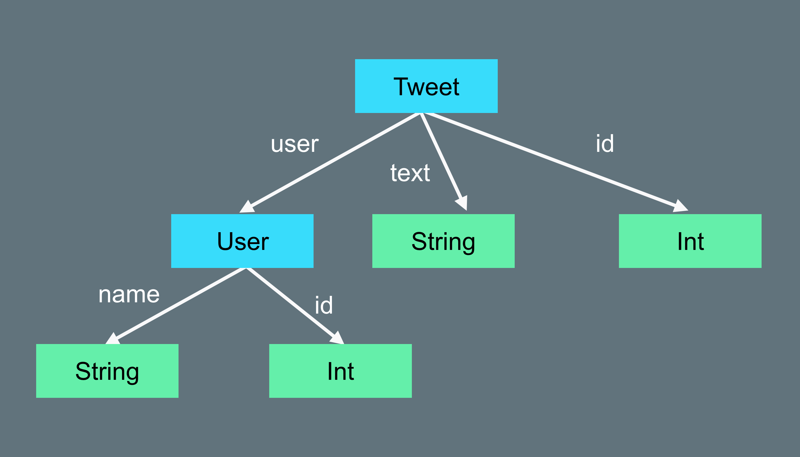

# StubKit

[](https://travis-ci.com/kateinoigakukun/StubKit) [](https://codecov.io/gh/kateinoigakukun/StubKit)

A smart stubbing system.

## Installation

### Using [Carthage](https://github.com/Carthage/Carthage)

```
github "kateinoigakukun/StubKit"
```

### Using [CocoaPods](https://cocoapods.org/)

```
pod 'StubKit'
```

## Usage

### Getting started

You can instantiate any kind of `Decodable` with a single line.

```swift
import StubKit

// Codable struct
struct User: Codable {
  let id: Int
  let name: String
  let sex: Sex
}

// User(id: 1234, name: "This is Stub String", sex: .female)
let stubUser = try Stub.make(User.self)
```

### Customize property

You can customize properties even if the property is defined as `let`.
```swift
let maleUser = try Stub.make(User.self) {
  $0.set(\.sex, value: .male)
}
// User(id: 1234, name: "This is Stub String", sex: .male)
```

### Using `Stubbable`

If you want to customize the default stub value, please conform `Stubbable`.
```swift
extension URL: Stubbable {
  static func stub() -> URL {
    return URL(string: "https://example.com")!
  }
}
```


## How does it work

StubKit mainly uses two techniques.
- Traverse using `Decoder` protocol.
- Inject value with non-mutable `KeyPath`.

### Traverse struct using `Decoder` protocol


Swift has `Decodable` protocol and if a type conforms to `Decodable`, Swift compiler generates some code to decode internally. So we can decode a JSON to Swift struct without any configuration. StubKit uses this system to construct instance through `Decoder`. `Decoder` is a protocol which provide a value by key or index like `JSONDecoder`. If we pass the `Decoder` which just provide a stub value recursively, we can instantiate any kind of `Decodable` instance.


### Inject value with non-mutable `KeyPath`

I know it's only natural but, Swift can't mutate `let` defined property. But Swift has `MemoryLayout<T>.offset` which provide the offset to the property from its own address. So actually in memory we can mutate `let` property.
